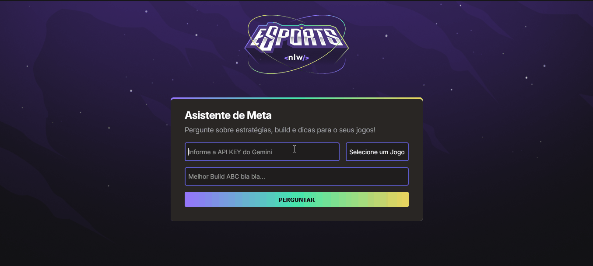

# NLW Agents

Aplicativo web que permite aos usuários receber dicas personalizadas sobre seu jogo favorito. Basta selecionar o jogo, fazer uma pergunta e a IA do Google Gemini responderá com sugestões diretas, atualizadas e contextualizadas.

---

## 🤖  Demonstração



---

## 🚀 Funcionalidades

- Seleção de um jogo disponível na lista

- Envio de perguntas sobre estratégias, builds ou dicas do jogo

- Integração com a API do Google Gemini via chave pessoal

- Retorno de respostas contextualizadas, objetivas e atualizadas

- Suporte a respostas em Markdown

- Sistema robusto de regras para evitar respostas genéricas ou inventadas

---

## 🧰 Tecnologias Utilizadas

- **HTML5, CSS3, JavaScript**
- **API Google Gemini**
- **Showdown.js**

---

## 🛠️ Como rodar o projeto

### ✅ Pré-requisitos

- Um ambiente web que execute arquivos HTML, CSS e JavaScript

- Pode ser aberto diretamente no navegador (sem necessidade de servidor backend)

- Navegador atualizado (recomendado: Chrome, Firefox, Edge)

- Você deve adquiri sua chave de API, na plataforma do Google Gemini

### 📦 Instalação

1. Clone o repositório:

```bash
git clone https://github.com/luizfspintoo/nwl-agents.git
```

### 🧠 Como funciona a IA?

```
A IA do Google Gemini é orientada com um prompt estruturado que:

    Define a IA como especialista em jogos

    Impõe regras para respostas assertivas, diretas e dentro do contexto do jogo

    Limita a resposta a 400 caracteres

    Exige que a IA utilize dados atualizados conforme o patch atual

Exemplo de regra usada:

- Se você não souber a resposta, diga "Não sei".
- Evite respostas genéricas ou inventadas.

```


### ▶️ Executando o Projeto

    Após realizar clone do repositório:

    Abra o arquivo index.html no navegador.

    Insira sua chave da API do Google Gemini e no input, selecione um jogo e realize uma pergunta.

### 🎮 Exemplo de uso

    Pergunta: Melhor build ranger jungle?

    Resposta da IA: **Itens:** Lâmina Sombria, Botas da Fúria, Arco do Caçador. **Runas:** Agilidade, Rastreador, Golpe Certeiro.

### ✅ Considerações e dúvidas
> ⚠️ **Atenção:** Sua chave de API é pessoal e intransferível. Nunca a compartilhe com outras pessoas para garantir sua segurança.

- Você pode obter sua chave de API acessando a documentação oficial em:  
  [https://ai.google.dev/gemini-api/docs](https://ai.google.dev/gemini-api/docs)

- No site, vá até a seção **"Chave de API"** e clique no link para o **Google AI Studio**, onde será possível gerar sua chave de forma segura.
